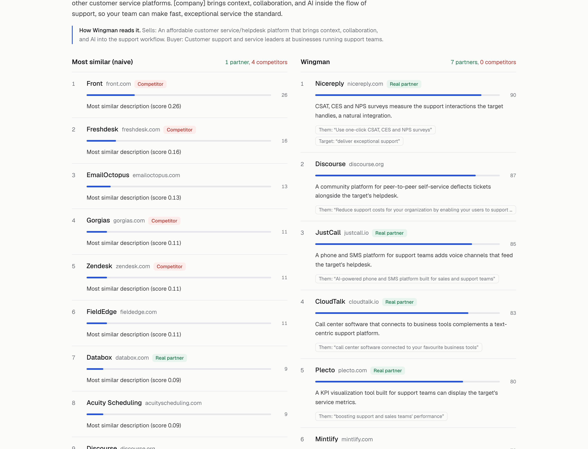
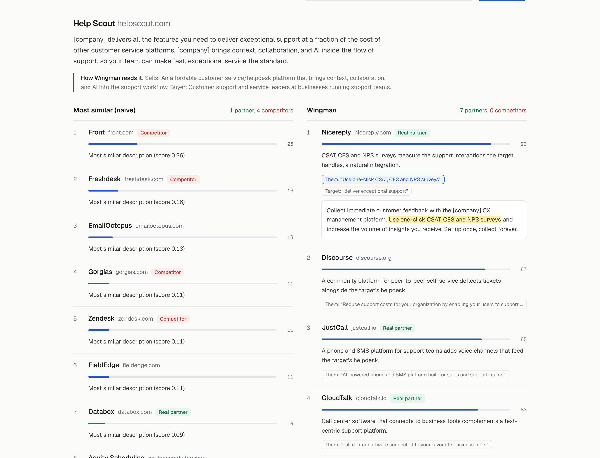
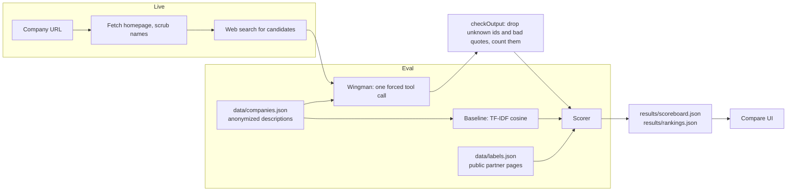

# Wingman

**Find the companies you should partner with, not the ones you compete with.**

## What is a partner?

A wedding photographer and a florist don't compete. One takes photos, the other sells flowers. But they have the same customers: couples getting married. So the photographer recommends the florist, the florist recommends the photographer, and both get more couples for free. That's a partner.

Another photographer is a competitor. You would never send them your couples.

Software companies work the same way. Help Scout sells email support software. Nicereply sends a "how did we do?" survey after each support email. Same customers (support teams), different product, so they integrate and send each other customers. Zendesk sells the same thing as Help Scout, so it's a competitor.

**A partner sells something different to the same customers.**

## The problem

The obvious way to find partners is to search for companies like yours. That finds the other photographers. Search for companies like Help Scout and the top results are Front, Freshdesk, Gorgias and Zendesk: all competitors.

## What Wingman does

Give it a company. It works out what that company sells and who buys it, then returns 10 companies that sell something different to those same buyers. Each pick comes with a one-line reason and the exact sentence it is based on, so you can check it instead of trusting a score. Look-alikes are flagged as competitors instead of recommended.



Click any quote and it lights up in that company's description.



## Does it work?

I took 10 real companies and collected the partners each one lists on its own website (154 in total). Then I hid those lists and asked both approaches for 10 suggestions per company.

| | Real partners found | Competitors suggested |
| --- | --- | --- |
| Search for similar companies | 12 of 154 | 25 |
| Wingman | 56 of 154 | 0 |

Details, per-company numbers and where it falls short are in [Eval](#eval).

## Features

- **Ranks 10 partner candidates** for a company, with a fit score from 0 to 100 and a one-line reason.
- **Flags** candidates that look close but should not be pitched: `competitor` (substitute product, same buyer) and `wrong_buyer` (complementary product, different buyer). Flagged candidates are listed after the 10, never inside them.
- **Cites evidence.** Every reason comes with short quotes from the target's or the candidate's description. Quotes must be exact substrings. Click one in the UI and it lights up in the text.
- **Compares against a naive baseline** (TF-IDF similarity) on the same companies, so you can see the difference side by side.
- **Grades both** against partnerships and competitors taken from public pages.
- **Runs live** on any company URL: it reads the homepage, searches the web for candidates, and ranks them.
- **Works over MCP**, so any MCP client can list targets and ask for partners.

## How it works



- `lib/types.ts` is the domain model. `Company` and `Label` are parsed with zod when the data loads. `Recommendation` is `{ candidateId, rank, fit, reason, flags, evidence }`. `FLAGS` is the one table of flags that the UI, the prompt and the scorer read.
- `lib/baseline.ts` is plain TF-IDF cosine over the descriptions, with no dependencies. Ties break by id, so it is deterministic.
- `lib/agent.ts` sends the model only ids and anonymized descriptions, never names. The prompt asks it to profile the target first (what it sells, who buys it), then pick 10 complementary companies that sell to the same buyer. It answers through one forced tool call, parsed with zod.
- `lib/score.ts` is pure. `checkOutput` drops candidate ids that are not in the pool and quotes that are not exact substrings of the cited description, and records each one as a problem. Nothing is silently fixed. `scoreTarget` and `aggregate` compute the metrics below. `npm test` covers both.
- `lib/live.ts` is live mode. It fetches the homepage (http and https only, 8 second timeout, 1 MB cap, private and loopback addresses blocked on the connecting socket), scrubs the brand name out of the text, finds candidates with the server-side web search tool, and runs the same ranking.

## Quickstart

```bash
npm install
cp .env.example .env   # add ANTHROPIC_API_KEY to run Wingman itself
npm run eval           # baseline always; Wingman only when the key is set
npm run dev            # http://localhost:3000
```

Other commands:

```bash
npm test                          # scoring and live-fetch tests
npm run eval -- --only c001       # smoke test one target; does not write results/
npm run find -- acme.com          # live mode from the terminal
npm run mcp                       # MCP server over stdio
```

The UI reads `results/rankings.json`, so once eval results are committed it works without a key. Live mode needs one.

| Variable | Required | What it does |
| --- | --- | --- |
| `ANTHROPIC_API_KEY` | For Wingman and live mode | Without it, eval runs the baseline only and live mode is off. |
| `WINGMAN_MODEL` | No | Model id. Defaults to `claude-opus-5-5`. |
| `DEMO_ACCESS_TOKEN` | To use live mode on a deployment | `next dev` leaves live mode open. Anywhere else, `/api/recommend` needs the header `x-demo-token` to match this value, and it stays closed when the value is unset. Open the UI with `?token=<value>`. |

## Eval

Each target company has labelled partners and competitors in `data/labels.json`, taken from public partner and integration pages. There are 10 targets and 181 companies, with 154 partner labels and 34 competitor labels. Sources for every label are in `data/SOURCES.md`. Both recommenders rank every other company in the set, anonymized.

- **hits@10**: labelled partners in the top 10.
- **competitors@10**: labelled competitors in the top 10.
- **partnersAvailable**: labelled partners that exist in the pool for that target.
- **hallucinated ids**: candidate or evidence ids that are not in the pool. Dropped from the ranking and counted.
- **bad quotes**: evidence quotes that are not exact substrings of the cited description. Dropped and counted.
- **flagged**: how many candidates were flagged, per flag.

The top 10 are the unflagged picks. A labelled competitor that Wingman flags as a competitor is shown in the UI but does not count toward `competitors@10`.

Numbers come from `results/scoreboard.json`, written by `npm run eval`.

| Recommender | hits@10 | competitors@10 | hallucinated ids | bad quotes |
| --- | --- | --- | --- | --- |
| Search for similar companies (TF-IDF) | 12 of 154 | 25 | n/a | n/a |
| Wingman (`claude-opus-5-5`, medium effort) | 56 of 154 | 0 | 0 | 0 |

Per target, real partners found in the top 10 (naive vs Wingman): Help Scout 1 vs 7, Cal.com 0 vs 5, Fathom 2 vs 4, Linear 2 vs 7, Lattice 3 vs 1, Buttondown 0 vs 7, SignNow 0 vs 5, OnPay 0 vs 7, FreeAgent 1 vs 7, Harvest 3 vs 6.

### What the eval found

- **Similar is not the same as partner.** The naive list put 25 labelled competitors into its top 10s. For Help Scout, four of its top five are direct competitors (Front, Freshdesk, Gorgias, Zendesk).
- **Wingman misses the systems you plug into.** Lattice is the one target where it did worse than naive (1 vs 3). Lattice's listed partners are mostly HR systems of record and single sign-on (BambooHR, Personio, Okta, OneLogin). Wingman picked tools sold to the same HR buyer, like recruiting and background checks, and missed the infrastructure a performance tool integrates with.
- **The partner and competitor line is blurry.** Wingman flagged 6 labelled partners as competitors, for example Miro for Linear and Humaans for Lattice. Some of these overlap for real; the label says only that they appear on the partner page.
- **competitors@10 is 0 partly by design.** Wingman flagged 46 look-alikes as competitors instead of ranking them, and flagged picks sit outside the top 10.

### Caveats

- **hits@10 is a lower bound.** Labels come from public partner pages, and most real partnerships are never published. A pick that is not labelled is not necessarily wrong.
- **The pool is closed and anonymized.** Names are scrubbed from every description and the model sees only ids, so it cannot just recall partnerships it read about in training.
- **The eval covers ranking only.** Live mode adds a discovery step (reading a homepage and searching the web) that this eval does not measure.

## MCP

Tools: `list_targets`, `recommend_partners` (`targetId` or `url`, plus `recommender`: `wingman` or `baseline`), and `get_company`.

```json
{
  "mcpServers": {
    "wingman": {
      "command": "npm",
      "args": ["--prefix", "/path/to/wingman", "run", "--silent", "mcp"],
      "env": { "ANTHROPIC_API_KEY": "..." }
    }
  }
}
```

## What I'd build next

- **Measure discovery.** Hold out known partners, run live mode on the target, and check whether web search surfaces them at all.
- **Integration partners as their own kind.** Ask separately for "systems this product plugs into" (HRIS, SSO, CRM), the gap the Lattice result shows.
- **Richer profiles.** Pull pricing, integrations and docs pages as well as the homepage, so the buyer is inferred from more than marketing copy.
- **Mutual fit.** Score the pair in both directions. A partnership only happens if the other side wants it too.
- **Feedback loop.** Let a user mark picks as good or bad and feed those back in as labels.

## License

MIT. See [LICENSE](LICENSE).
